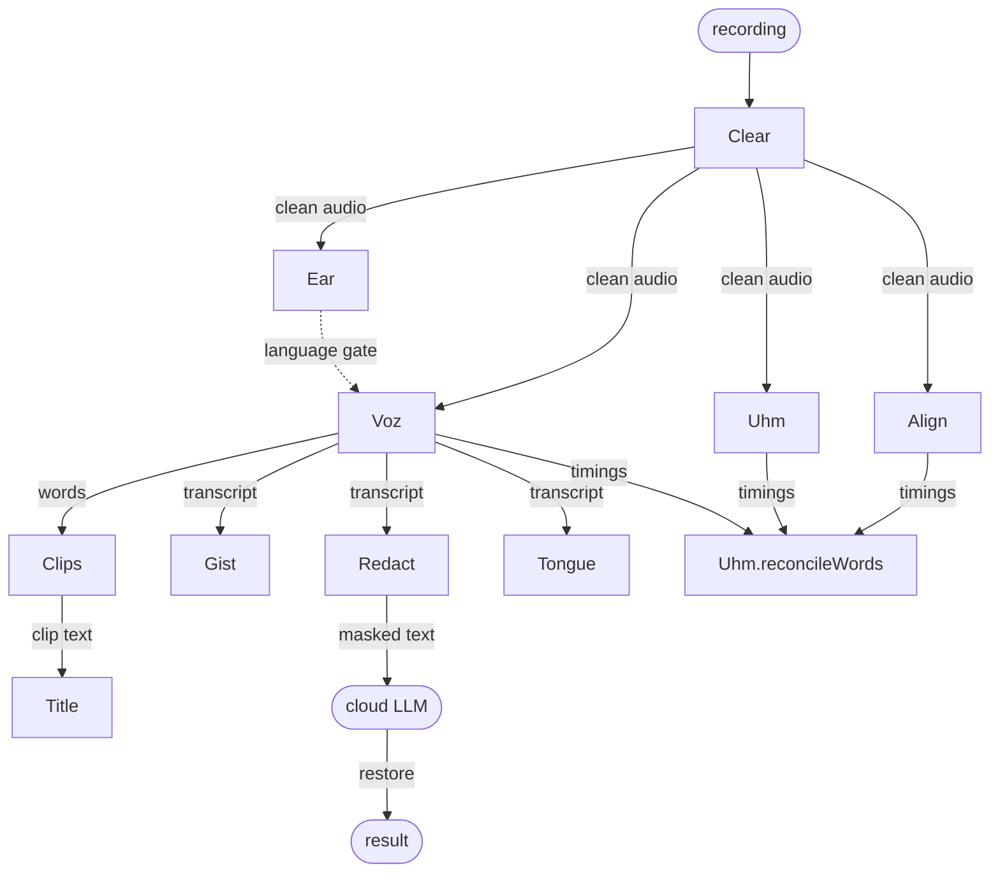

# desert-ant-local-ai-sdks

**The React Native SDK for [Desert Ant Labs](https://github.com/Desert-Ant-Labs).**
Expo modules over the on-device models in
[`desert-ant-core`](https://github.com/Desert-Ant-Labs/desert-ant-core): Core ML on
iOS, LiteRT on Android, no server, no API key.

<table>
  <tr>
    <td>
      <strong>Built by Rodrigo Figueroa</strong><br />
      Want to ship these models in your app? I'm open for work.<br /><br />
      <a href="https://cal.com/rodrigo-figueroa-vmbwee"></a>
    </td>
  </tr>
</table>

## Models

| Model | Input → output | Weights | iOS | Android |
| --- | --- | --- | --- | --- |
| [Clear](packages/clear) | audio → denoised, dereverbed, loudness-normalized audio | ~9 MB | 18+ | ✓ |
| [Ear](packages/ear) | audio → spoken language (99) | ~9 MB | 17+ | ✓ |
| [Voz](packages/voz) | audio → transcript with word timings (25 languages) | ~490 MB | 17+ | — |
| [Uhm](packages/uhm) | audio → filler-word spans | ~45 MB | 17+ | — |
| [Align](packages/align) | audio → Apple `SpeechAnalyzer` transcript with refined word boundaries | 0.7 MB + Apple locale | 26+ | — |
| [Clips](packages/clips) | transcript → ranked highlight ranges | ~288 MB | 18+ | — |
| [Title](packages/title) | text → 3–8 word title + description (MLX) | ~280 MB | download only¹ | — |
| [Gist](packages/gist) | text → topics (36-topic taxonomy, 101 languages) | ~74 MB | 17+ | ✓ |
| [Redact](packages/redact) | text → text with PII masked + reversible mapping | ~12 MB | 17+ | ✓ |
| [Tongue](packages/tongue) | text → language (84), synchronous | 2 MB, bundled | blocked² | ✓ |
| [Emo](packages/emo) | text → ranked emoji | ~5 MB | 17+ | ✓ |
| [Shapes](packages/shapes) | stroke points → line / rectangle / triangle / ellipse / star | 0.2 MB | 17+ | ✓ |

[`packages/core`](packages/core) holds the shared types, error codes and the single
`spm_dependency` bridge to `desert-ant-core`.

¹ Title's generation is behind a SwiftPM package trait (`MLX`) that CocoaPods cannot
enable. The weights download; `describe()` throws `ERR_UNSUPPORTED_PLATFORM`.

² `desert-ant-core` 3.1.0 declares a `Tongue` product but does not export it.

## How they compose

Every model is independent: `load()`, call, `release()`. The useful part is wiring
outputs into inputs. Audio models hand you a file or word timings, and text models
take any string, including a transcript.



Some combinations:

- **Podcast clipper:** Clear → Voz → Clips → Title. Clean the audio, transcribe it,
  rank the moments, then title each one.
- **Filler-free cuts:** Uhm + Voz (or Align) → `reconcileWords`. You get word spans
  that end on silence instead of mid-word.
- **Privacy-safe summaries:** Voz → Redact → your cloud LLM → `restore()`. Names,
  emails and IDs never leave the device, and you put them back afterwards.
- **Language sanity check:** Ear (from the sound) vs. Tongue (from the transcript).
  When they disagree, the transcriber was likely out of its languages.
- **Live text fields:** Emo, Tongue and Shapes are small and fast enough to run on
  every keystroke or stroke.

```ts
import { Clear } from '@desert-ant-labs/react-native-clear';
import { Voz } from '@desert-ant-labs/react-native-voz';
import { Clips } from '@desert-ant-labs/react-native-clips';
import { Uhm } from '@desert-ant-labs/react-native-uhm';
import { Redact, restore } from '@desert-ant-labs/react-native-redact';

const { uri } = await (await Clear.load()).enhance({ uri: recording.uri });

const { words } = await (await Voz.load()).transcribe({ uri });
const moments = await (await Clips.load()).find({ sentences: Clips.toSentences(words) });
// moments[0].ranges -> [{ start: 32.1, end: 41.4 }]

const { fillers } = await (await Uhm.load()).analyze({ uri });
const cuttable = Uhm.reconcileWords(words, fillers);

const masked = await (await Redact.load()).redaction(words.map((w) => w.text).join(' '));
const summary = await summarize(masked.redactedText); // '[GIVEN_NAME_1] …'
restore(masked, summary);
```

## Install

The packages are not on npm yet. Add the ones you need from this repo (as a
workspace, a git dependency or a local path), then register their config plugins:

```json
{
  "expo": {
    "plugins": [
      "@desert-ant-labs/react-native-clear",
      "@desert-ant-labs/react-native-voz"
    ]
  }
}
```

The plugins only ever raise the iOS deployment target and narrow Android ABIs to
`arm64-v8a` / `x86_64`, so they compose in any order. These are native modules,
so use a dev build: Expo Go is not supported.

## Requirements

| | |
| --- | --- |
| Expo SDK | 57+ (Expo Modules 2.0 Swift macros) |
| React Native | 0.75+ (`spm_dependency`); the example uses 0.86.3 |
| Xcode | 26 (`desert-ant-core` is `swift-tools-version: 6.2`) |
| iOS | 17.0 minimum; 18.0 with Clear or Clips; Align needs 26 at runtime and reports `isSupported: false` below it |
| Android | API 24+ |

## Architecture

- **iOS:** thin Expo Modules 2.0 wrappers (`@ExpoModule`, `@SharedObject`,
  `@Record`) over `desert-ant-core` SPM products. The package is linked once, by
  the `DesertAntCore` pod, so its shared objects are never duplicated.
- **Android:** Kotlin Expo modules over `ai.desertant:*` artifacts from Maven
  Central. The Kotlin halves are written but **not yet compiled or run on a
  device**.
- One TypeScript surface per model; downloads report progress and errors map to
  shared `DesertAntError` codes.

Design notes and measurements are in [`docs/architecture.md`](docs/architecture.md).

## Develop

```bash
npm install
npm run build   # packages + config plugins
npm test

cd apps/example
npx expo prebuild --clean
npx expo run:ios
```

`apps/example` carries a `patch-package` fix for react-native 0.86.3's
`spm.rb` (it corrupts `Pods.xcodeproj`). Drop it when moving to 0.87.1+.

## License

The SDK code is MIT. The models are under the
[Desert Ant Labs Source-Available License 1.0](https://license.desertant.com/1.0):
free below 100,000 monthly active devices per platform per model, attribution
required, and no training competing on-device models on them or on their outputs.
